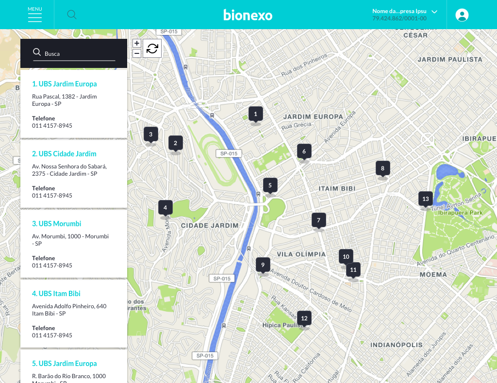

**Portal Brasileiro de Dados Abertos**

O Portal Brasileiro de Dados Abertos é a ferramenta disponibilizada pelo governo para que todos possam encontrar e utilizar os dados e as informações públicas. Destas informações disponibilizadas temos especial interesse pelos dados com informações sobre as UBS - Unidades Básicas de Saúde (http://dados.gov.br/dataset/unidades-basicas-de-saude-ubs).

**Objetivo**

Desenvolver uma aplicação Web API que irá informar aos clientes desta API as UBS mais próximas de acordo com sua localização, como no exemplo abaixo:

**Dados**

Os dados que esperamos como retorno da API devem conter as seguintes propriedades:

| Propriedade                       | Tipo   | Descrição                       |
| --------------------------------- |:------:| ------------------------------- |
| `id`                              | Number | Id da ubs                       |
| `name`                            | String | Nome                            |
| `address`                         | String | Endereço                        |
| `city`                            | String | Cidade                          |
| `phone`                           | String | Telefone                        |
| `geocode.lat`                     | Number | Latitude                        |
| `geocode.long`                    | Number | Longitude                       |
| `scores.size`                     | Number | Estrutura física/Tamanho da UBS |
| `scores.adaptation_for_seniors`   | Number | Adaptações para idosos          |
| `scores.medical_equipment`        | Number | Equipamentos disponíveis        |
| `scores.medicine`                 | Number | Medicamentos disponíveis        |

O campo `scores` são representado por uma escala de 1 à 3.

**Requisitos**

 - Utilize a linguagem e frameworks de sua preferência 
 - Organize seu   projeto com gerenciador de pacote, testes e documentação
 - Deve ser possível utilizar o retorno da API em aplicações Web e Mobile
 - Não há necessidade de desenvolver a aplicação mobile 
 - Caso deseje desenvolver a aplicação web, utilize um framework JS de sua preferência e um pré-processador CSS
